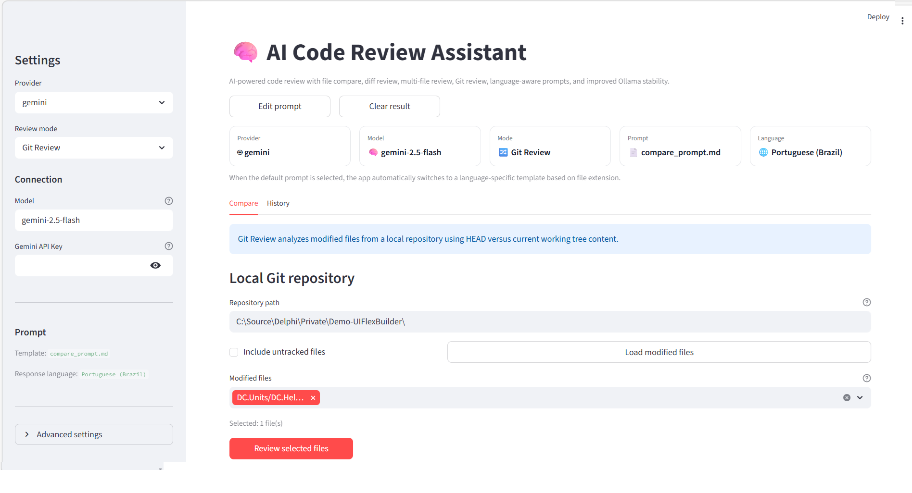
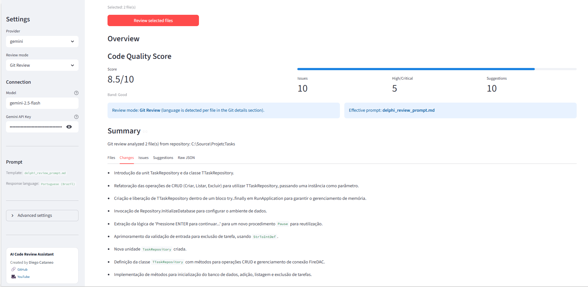
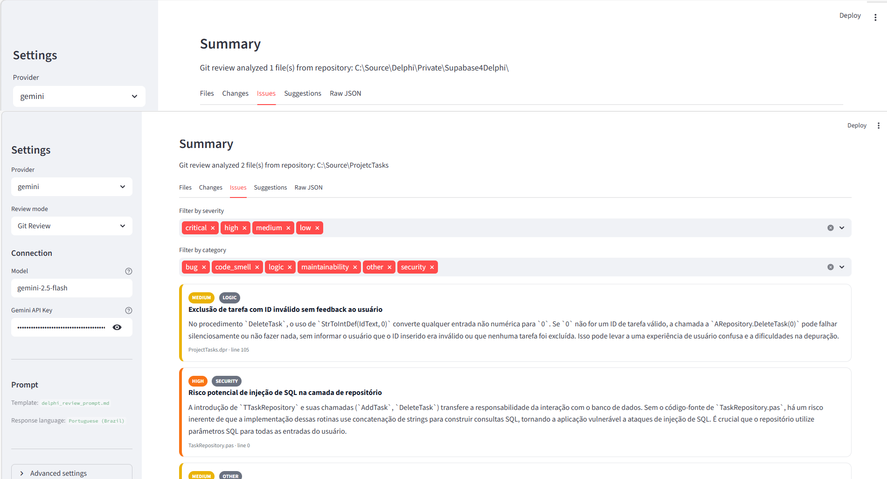

# AI Code Review Assistant


AI-powered code review tool designed to analyze code changes and generate structured technical feedback.

The application compares source code files, analyzes diffs, reviews multiple files, and can inspect Git repositories to help developers detect bugs, code smells, and potential regressions.

The system supports multiple AI providers including **OpenAI**, **Google Gemini**, and **local models via Ollama**.

---

# Why this project exists

Code review is one of the most important practices in software development, but reviewing large changes can be time-consuming and error-prone.

This project explores how **Large Language Models (LLMs)** can assist developers by automatically analyzing code changes and generating structured technical insights.

The goal is not to replace human reviewers, but to **augment the review process with AI-assisted analysis**.

---

# Application Preview

Create a folder called **docs/** and place screenshots there.

Example:

```
docs/
 ├── dashboard.png
 ├── review.png
 └── issues.png
```

Then the README will show them:

## Review Dashboard



## Code Review Output



## Issues Analysis



---

# Key Features

### File Compare

Compare two source files and generate an AI-powered review of the entire code.

### Diff Review

Analyze only the modified lines between two files using unified diff.

### Multi-File Review

Review multiple files in a single analysis session.

### Git Review

Inspect modified files directly from a local Git repository.

### Multi AI Providers

Switch between multiple AI providers:

* OpenAI
* Google Gemini
* Ollama (local models)

### Structured AI Output

The system produces structured review results including:

* summary
* issues
* severity levels
* suggestions
* code quality score

---

# How It Works

The review pipeline works as follows:

1. User uploads files or selects a Git repository
2. The application generates a code diff
3. The prompt system prepares a structured AI request
4. The selected AI provider analyzes the code
5. The system returns structured issues and suggestions

---

# Architecture

The system is designed using a modular architecture that separates UI, review engine, prompts, and AI providers.

```
Streamlit UI
     ↓
Review Engine
     ↓
Prompt System
     ↓
Provider Abstraction Layer
     ↓
OpenAI | Gemini | Ollama
```

This architecture allows the system to support new AI providers with minimal changes.

---

# Supported Review Modes

| Mode              | Description                                  |
| ----------------- | -------------------------------------------- |
| File Compare      | Compare two files entirely                   |
| Diff Review       | Analyze only modified lines                  |
| Multi-File Review | Review multiple files                        |
| Git Review        | Analyze modified files from a Git repository |

---

# Example AI Review Output

```json
{
  "summary": "Refactoring improved readability but introduced a potential null reference risk.",
  "score": 7.8,
  "issues": [
    {
      "severity": "high",
      "category": "bug",
      "title": "Possible null reference",
      "description": "Object may be null before method invocation."
    }
  ]
}
```

---

# Project Structure

```
code_compare_ai
│
├── app.py
├── core
│   ├── review_engine.py
│   ├── prompts.py
│
├── providers
│   ├── openai_provider.py
│   ├── gemini_provider.py
│   └── ollama_provider.py
│
├── prompts
│   ├── default.md
│   ├── delphi_review.md
│   └── python_review.md
│
├── ui
│   └── components.py
│
├── README.md
├── CHANGELOG.md
├── LICENSE
└── ROADMAP.md
```

---

# Technologies Used

* Python
* Streamlit
* OpenAI API
* Google Gemini API
* Ollama (local LLMs)
* Git CLI integration

---

# Installation

Clone the repository:

```bash
git clone https://github.com/DelphiCreative/Python.git
cd code_compare_ai
```

Create a virtual environment:

```bash
python -m venv venv
```

Activate it:

Windows

```bash
venv\Scripts\activate
```

Install dependencies:

```bash
pip install -r requirements.txt
```

Run the application:

```bash
streamlit run app.py
```

---

# Configuration

You can configure providers using environment variables.

Example `.env` file:

```
OPENAI_API_KEY=
GEMINI_API_KEY=

OLLAMA_BASE_URL=http://localhost:11434
OLLAMA_TIMEOUT_SECONDS=300
OLLAMA_MAX_PROMPT_CHARS=18000
```

---

# Roadmap

Planned improvements for future versions:

* language-aware prompts
* repository-wide analysis
* pull request review
* policy-based code review
* IDE integration

---

# Author

**Diego Cataneo**

Software developer focused on backend systems and developer productivity tools.

GitHub
https://github.com/DelphiCreative

YouTube
https://youtube.com/@delphicreative
